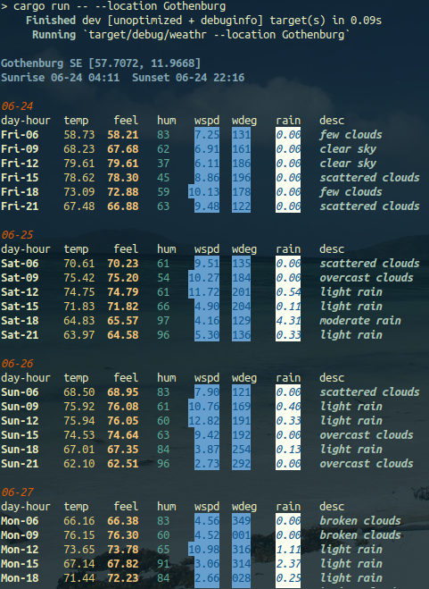

weathr
======= 

Setup - Obtain API key
1. Create an [account](https://openweathermap.org/)
2. Export free subscriber api key as env variable, e.g. export WEATHER_API_KEY="<API_TOKEN>"

```sh
> cargo run -- -h
weathr 0.1.0
Bibek Pandey
Simple CLI Weather App using OpenWeatherMap

USAGE:
    weathr [OPTIONS] --location <location>

OPTIONS:
    -d, --debug                  Enable debug
    -h, --help                   Print help information
    -l, --location <location>    City Location
    -o, --output <output>        Display output type [possible values: tabular]
    -u, --units <units>          Specify units type [possible values: imperial, metric]
    -V, --version                Print version information
```
    
<p float="left">
   
</p>

